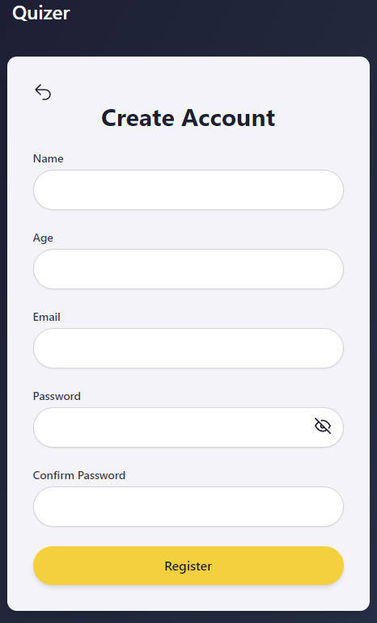
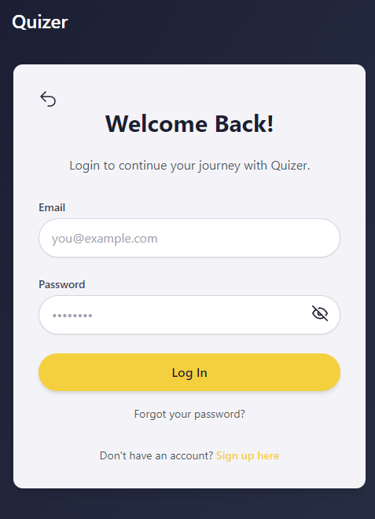
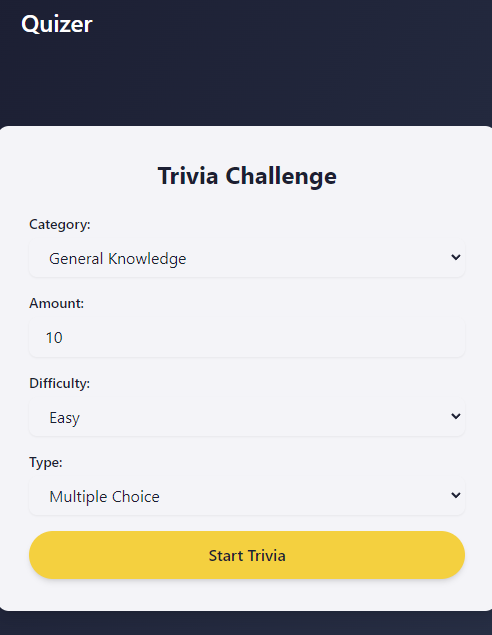

# 🎯 Quizer Application

<p align="center">
  <b>Quizer App</b> - A fully functional quiz platform built using React, TypeScript, TailwindCSS, and a custom Node.js backend to manage user data and Vite.
</p>

---

## 🚀 Features

- 📝 **User Authentication**: Register and Login functionality using backend server.
- 🎯 **Dynamic Quiz**: Questions fetched from [Open Trivia DB](https://opentdb.com/) API with support for various question types.
- 🕒 **Quiz Timer**: Users have a limited time to complete the quiz.
- 📊 **Results Display**: Detailed results of correct, incorrect, and unanswered questions.
- 💾 **Resume Functionality**: Users can resume the quiz from where they left off (localStorage support).
- 🌐 **Responsive UI**: Styled with TailwindCSS for a smooth and responsive user experience.
- 📑 **Landing Page**: Includes a landing page with basic information about the app.

## 🖼️ Screenshots

Here are some screenshots of the application to give a better understanding of the interface:

<table>
  <tr>
    <td><b>Landing Page</b></td>
    <td><b>Landing Page (Login)</b></td>
    <td><b>Register Page</b></td>
  </tr>
  <tr>
    <td></td>
    <td></td>
    <td></td>
  </tr>
  <tr>
    <td><b>Login Page</b></td>
    <td><b>Dashboard Page</b></td>
    <td><b>Quiz Page</b></td>
  </tr>
  <tr>
    <td></td>
    <td></td>
    <td></td>
  </tr>
</table>

## 🛠️ Technologies Used

- **Frontend**:
  - React.js
  - TypeScript
  - TailwindCSS
  - Axios for API calls
  - React Router for navigation
  - LocalStorage for quiz resume functionality
- **Backend**:
  - Node.js & Express.js
  - [Backend Repository](https://github.com/Adsyarif/server-quizer)

## 📦 Installation Guide

### Backend Setup

The backend manages user authentication and stores user data. Clone the backend repository:

```bash
Backend Setup
git clone https://github.com/Adsyarif/server-quizer.git
cd server-quizer
yarn install
yarn dev
The server will run on http://localhost:8080 by default.
````

### Frontend Setup

The backend manages user authentication and stores user data. Clone the backend repository:

```bash
Frontend Setup
Clone this repository:
bash
Copy code
git clone https://github.com/your-username/quizer-frontend.git
cd quizer-frontend

Install dependencies:
bash
Copy code
yarn install

Run the development server:
bash
Copy code
yarn dev
The app will be accessible at http://localhost:5173.
````

### Frontend Setup

The backend manages user authentication and stores user data. Clone the backend repository:

```bash
💻 How to Use
Landing Page: Explore the landing page for an introduction to the app.
Register / Login: Create an account or log in to start taking quizzes.
Dashboard: Once logged in, you can start a quiz, and select the quiz atribute.
Quiz:  Once logged in, start a quiz, answer questions, and track your progress with the timer. Each question is fetched dynamically.
Resume Quiz: If you close the browser mid-quiz, you can resume where you left off on your next visit.

🔧 Core Code Structure
The frontend code is organized as follows:

bash
Copy code
src/
│
├── assets                # Necessary image assets
├── components/           # UI components like buttons, inputs, etc.
│   ├── common            # Landing page
│   └── Quiz              # Registration form
│
├── context/              # Global state management
│   └── AppContext.tsx    # Manage state quiz and user
│
├── hooks/                # Custom hooks
│   └── useTrivia.ts      # Handles fetch
│
├── pages                 # Page layout
│   ├── Auth              # Authorization page access need
│   │   ├── Login         # Login page
│   │   ├── Register      # Register page
│   │   └── index.ts      # Auth Page Collector
│   │
│   ├── Dasboard          # Dasboard page
│   ├── Home              # Landing page
│   ├── Quiz              # Quiz page
│   └── index.ts          # Page Collector
│
├── App.tsx               # Main App component with routes
├── index.tsx             # Entry point of the React application
└── styles/               # Custom TailwindCSS styles


📃 API Integration
Open Trivia DB API
To fetch quiz questions, we use the Open Trivia DB API:

Example request:
bash
Copy code
GET https://opentdb.com/api.php?amount=10&type=multiple
This returns multiple-choice questions, which are displayed one by one on the quiz page.

Backend API (User Management)
The backend manages user registration and login. The following API endpoints are used:

Register: POST /api/register
Login: POST /api/login
For more details, refer to the Backend Repository.

🧑‍💻 Contribution
Contributions are welcome! Feel free to open an issue or submit a pull request for any bug fixes or improvements. Please follow the guidelines outlined below.

Fork the repository.
Create your feature branch: git checkout -b feature/YourFeature
Commit your changes: git commit -m 'Add YourFeature'
Push to the branch: git push origin feature/YourFeature
Open a pull request.
````

<p align="center">Made with ❤️ by <a href="https://github.com/Adsyarif">Muhammad Adrisa Nur Syarif</a></p>
